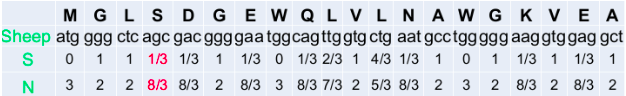

# Bioinformatics Toolkit Application

## ABSTRACT

In genetics, the Ka/Ks ratio, also known as ω or dN/dS ratio is used to estimate the balance between neutral mutations, purifying selection and beneficial mutations acting on a set of homologous protein-coding genes. It is calculated as the ratio of the number of nonsynonymous substitutions per non-synonymous site (Ka), in a given period of time, to the number of synonymous substitutions per synonymous site (Ks), in the same period. The latter are assumed to be neutral, so that the ratio indicates the net balance between deleterious and beneficial mutations. Values of Ka/Ks significantly above 1 are unlikely to occur without at least some of the mutations being advantageous. If beneficial mutations are assumed to make little contribution, then Ks estimates the degree of evolutionary constraint.

The goal of the project is to develop a desktop software using which biologists can calculate the dN/dS value. In the user interface user will provide input in a file and te software will automatically calculate the following things

<ol>
    <li>Synonymous Change</li>
    <li>Non Synonymous Change</li>
    <li>Synonymous Sites</li>
    <li>Non Synonymous Sites</li>
    <li>pN(number of nonsynonymous substitutions per non-synonymous site)</li>
    <li>pS(number of synonymous substitutions per synonymous site)
dN/dS ratio</li>
    <li>pn/ps</li>
    <li>dn/ds</li>
</ol>

A website where users(biologists) can give their review about the software.

## INTRODUCTION

The ratio of non-synonymous to synonymous substitutions (dN/dS) is a useful measure of the strength and mode of natural selection acting on protein-coding genes. It is widely used to study patterns of selection on protein genes on a genomic scale-from the small genomes of viruses, bacteria, and parasitic eukaryotes to the largest eukaryotic genomes. 

A change (mutation) in a codon in a gene may/may not change the way the protein (produced out the gene) functions. This in return may affect the fitness of the organism.

<b>GGG → GGA (Synonymous Change)</b>

<b>AGG → AGG (Non Synonymous Change)</b>

### Positive Selection (Adaptive or Darwinian selection)

After the mutation, the fitness of the new allele (mutant) increases. This helps the organism to adapt better to the system, survive and reproduce more. Therefore, selection favors the mutation.

This selection is also known as adaptive or Darwinian selection.

### Negative Selection (Purifying selection)

After the mutation, the fitness of the new allele (mutant) decreases. Therefore, chances of surviving the mutant are reduced. Therefore, selection works against the mutation.

This selection is also known as purifying selection.

For example, a single mutation in β-globin gene from glutamic acid codon GAG to valine codon GUG causes sickle cell anemia in humans.

### Neutral Selection

Neither advantageous or disadvantageous. Maybe selection is invisible or no selection or both positive and negative selection cancel each other. Case is ambiguous.

Frequency subject to ‘drift’ in the population. Random drift – random changes in small populations.

### Figuring out Neutral, Negative and Positive Selection from dN/dS
<ol>
    <li>dN/dS = 1 (Neutral Selection)</li>
    <li>dN/dS < 1 (Negative Selection)</li>
    <li>dN/dS > 1 (Positive Selection)</li>
</ol>

### Counting Method
This project aims for calculating the value of dN/dS using the counting method. Below is an example

S(Whale) = 12, N(Whale) = 48

S(Sheep) = 12.33, N(Sheep) = 47.67

### Calculations
<ol>
    <li>Synonymous changes: 3</li>
    <li>Non-Synonymous changes: 5</li>
    <li>Synonymous Sites = (S(whale) + S(sheep))/2 =  12.17</li>
    <li>Non Synonymous Sites  = (N(whale) + N(sheep))/2 =  47.83</li>
    <li>pN = Non-synonymous Changes/Non-Synonymous sites = 0.10</li>
    <li>pS = Synonymous Changes/Synonymous Sites = 0.25</li>
    <li>dN = -(3/4)ln(1-(4/3)*pN) = 0.11</li>
    <li>dS = -(3/4)ln(1-(4/3)*pS) = 0.29</li>
    <li>dN/dS =0.39</li>
    <li>This result suggests that the sequence is under <b>Negative Selection</b>.</li>
</ol>

## Software

Download our application software form <a href="https://kartikpapney.github.io/Bioinformatics-Project-WebPage/" target="_blank">Link</a>
